The simplest way to transfer data/outputs between your local computer and Paperspace is using a Gradient Jupyter Notebook. 
In general, Jupyter notebooks are incredibly powerful; they are an interactive python coding environment and allow you to run snippets of code to see how they function. They are used for tensorflow tutorials (you can download them too! [see the neural network tutorials available](https://www.tensorflow.org/tutorials/images/cnn) ). If you upload any jupyter notebook code to Paperspace, you can use its contents to train/test a model as well within the paperspace notebook environment.

The following steps in this tutorial describe only how to upload datasets and download models/outputs using the Gradient Jupyter Notebook feature. To learn more about how you can use these notebooks in paperspace, please refer [here](https://support.paperspace.com/hc/en-us/articles/115004535973-Getting-Started-with-Notebooks)

Jump to creating a Jupyter notebook in Paperspace [here](#creating-a-jupyter-notebook-in-paperspace)

Jump to uploading data to Paperspace [here](#uploading-data-to-paperspace).

Jump to downloading data from Paperspace [here](#downloading-outputs-from-paperspace).

# Creating a Jupyter notebook in Paperspace

(1) After logging into Paperspace, toggle your mouse to the Gradient section (in the left hand column of the Paperspace consule) to see the drop down menu of Gradient options. Select Notebooks (second option) to access the control console for jupyter notebooks. 

(2) Next you need to create a notebook. This is done by selecting the bright seafoam green button in the middle of the right hand side of the Notebook console. 

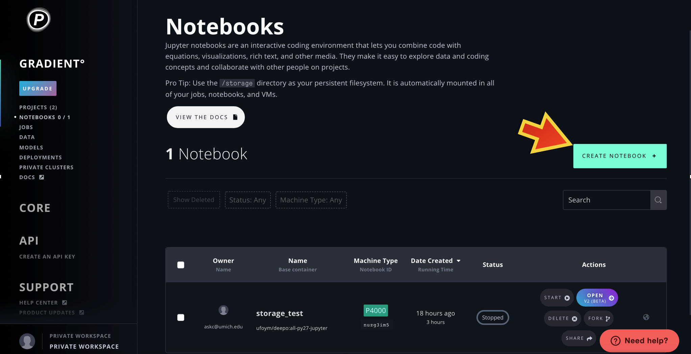

You will be prompted to select a container (which sets up the operating system/environment in which to run the notebook). For uploading data you don't need anything in particular, so select the first option, titled fast.ai. 

You then need to scroll down the page and select the type of machine/computer you would like to run your notebook on. It is recommended to select P4000 or P5000 (the second or third option in the first row). 

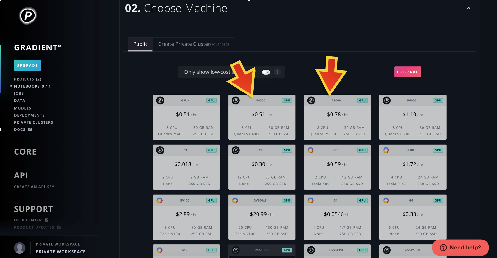

Scroll down again to the section Notebook options. It is highly recommended to set a time limit upon your notebook; if you forget to stop the notebook, you will get charged for it! Scroll to the very bottom of the page, and select the dark teal +Create Notebook button.
This action creates a separate web page that is running the notebook instance.

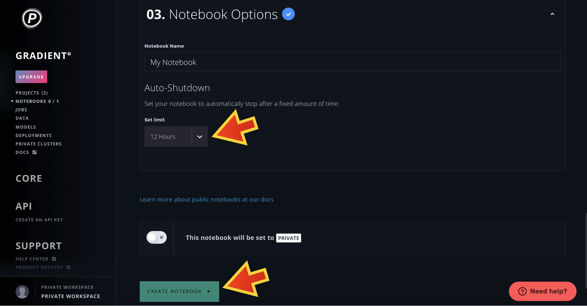

(3) Toggle to the separate web page where your notebook is running. Under the files tab, you can view the file system of you Paperspace server. These of the files that all of your projects/jobs can access. The `/datasets` folder holds all of the public datasets mentioned above, where as `/storage` is your persistent storage space, which means that anything you upload there will 'persist' across jobs, experiments, and projects. Note that you will be charged for the amount of storage space you use.

# Uploading data to Paperspace

Just as an aside, there are multiple datasets that are publicly available in Paperspace. They are located in the `/datasets` folder, and can be accessed in any project. A list of these datasets (and a brief description of them) is found 
[here](https://docs.paperspace.com/gradient/data/public-datasets-repository).

(1) Create a notebook (using the instructions [here](#creating-a-jupyter-notebook-in-paperspace)) or start up an already created notebook, and toggle to the notebook window.

(2) To upload a dataset from your local computer, you first need to zip the dataset locally. You then can upload it by selecting the Upload button on the right hand side of the console. This will prompt you to select a file to upload from you local file system. Once you have selected your zipped dataset, make sure to hit the blue upload button next to your zipped filename to complete the upload.

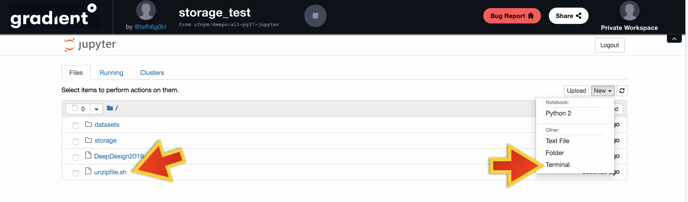

(4) Now that your zipped file is uploaded into Paperspace, you need to unzip it. An easy way to do this is to upload the `unzipfile.sh` script provided in this repository. Once that script is uploaded, select the New button (next to the upload button) and select Terminal from the dropdown menu. This will take you to a terminal for the notebook. If you typw `ls`, in the command line, you can view the files/folders. To unzip your dataset, type `bash unzipfile.sh <yourdatasetfilename.zip>`, or `bash unzipfile.sh storage/<yourdatasetfilename.zip>` if you placed your dataset into persistent storage, and hit the enter key. There will a large text output to the terminal screen once the script is running. Once it is finished, you can hit the back button on your browser to return to the notebook filesystem, where you can view the unzipped dataset. 

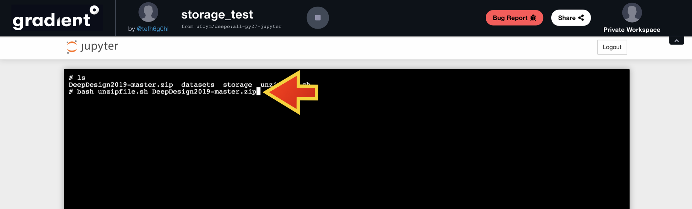

# Downloading outputs from Paperspace

You can also use Gradient Jupyter notebooks to download data or model outputs from Paperspace. 
There are two locations where you can write and read data in Paperspace: the `/storage` (which is persistent storage that can be accessed by any Project) and `/artifacts` (which is associated with a specific job/experiment within your Project workspace).

## Download from `/storage`

(1) Create a notebook (using the instructions [here](#creating-a-jupyter-notebook-in-paperspace)) or start up an already created notebook, and toggle to the notebook window.

(2) To download a single file, navigate through the `/storage` file hierarchy to that file location. Select the checkbox next the filename, and then select the Download button. NOTE: the Download button will only appear once you have selected the file to download.

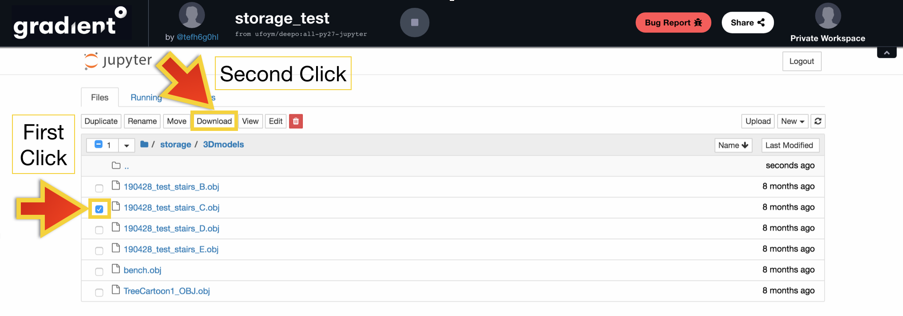

(3) To download a folder, you will have to zip the folder and then follow the instructions in the above step. 

## Download from `/artifacts`
You don't need a jupyter notebook running to do this! Just login to your Paperspace account. 

(1) Toggle to the Projects Console. Select the Project that contains the experiment from which you want to retrieve the output.

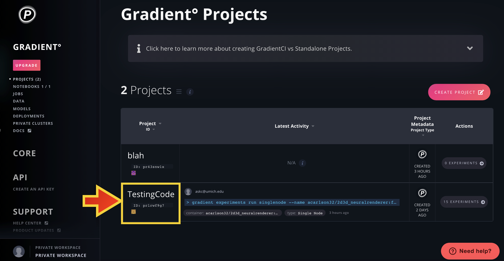

(2) Within the Project console, select the experiment from which you want to retrieve the output.

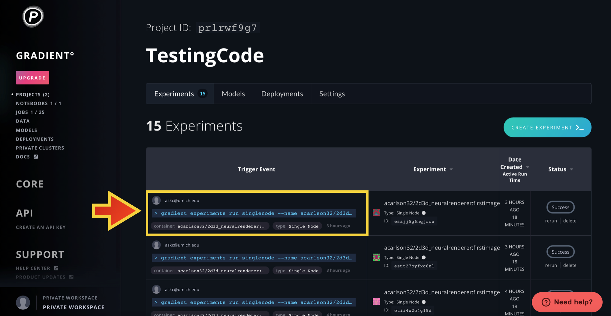

(3) Once in the experiment console, select the `Status` button (in the below example, it was a successful run, so it is labeled as such) which will take you to the logs and outputs of the experiment.

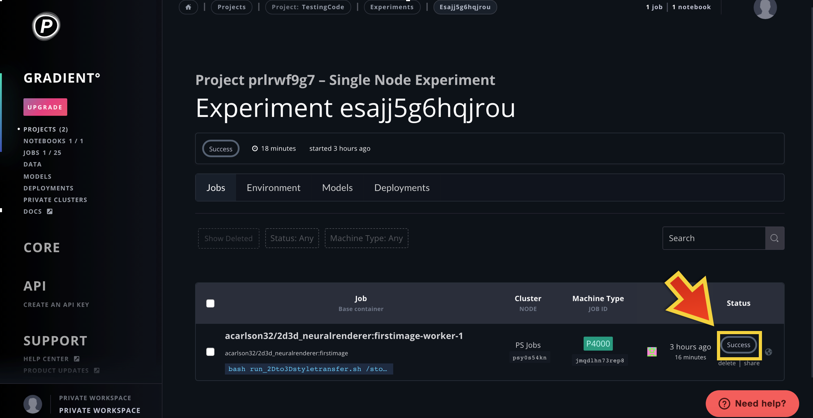

(4) Select the `Artifacts` button. This will take you to the Artifacts Storage console, which is organized as a file hierarchy similar to what you saw with the jupyter notebooks.

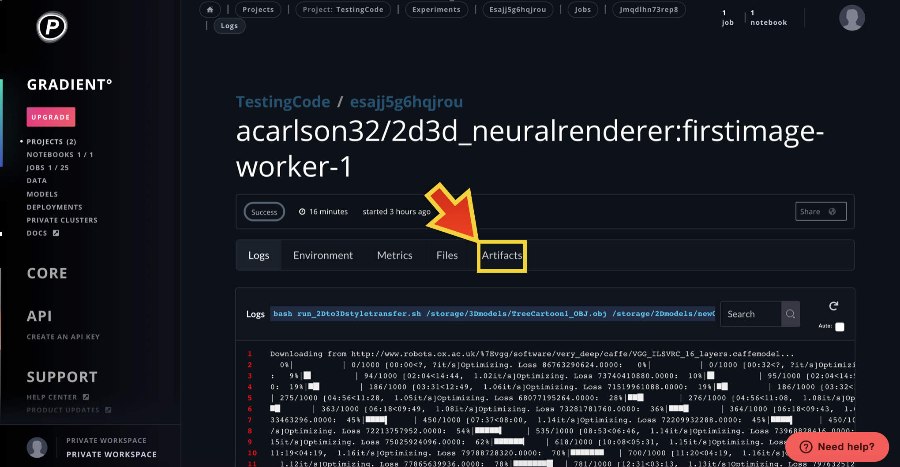

(5) If you specified a results directory(ies) in your run script for the experiment, that folder hierarchy is mirrored in the Artifacts storage location. Select the results directory as shown below.

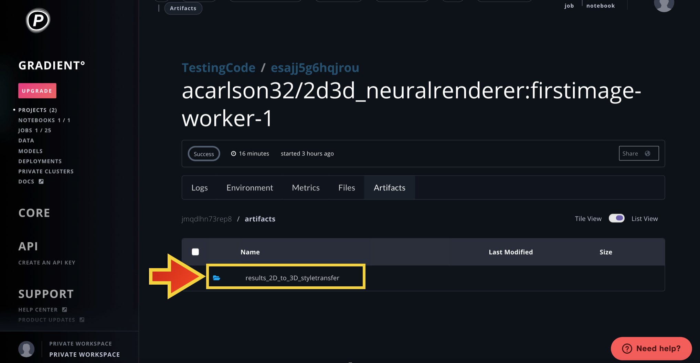

(6) Select the `Download` button next to the artifact/output you wish to download. You will be prompted in a pop-up window to select a location on your local computer where you would like to store the artifact.

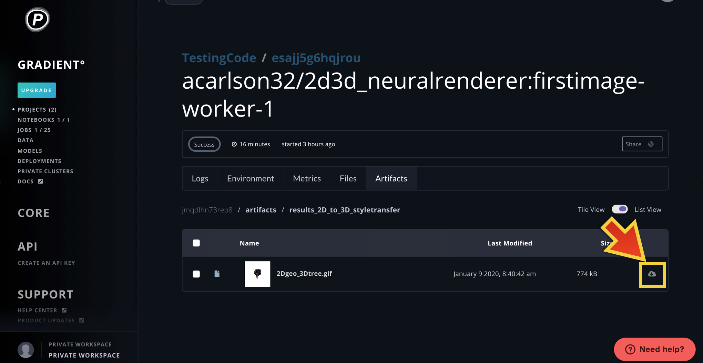
