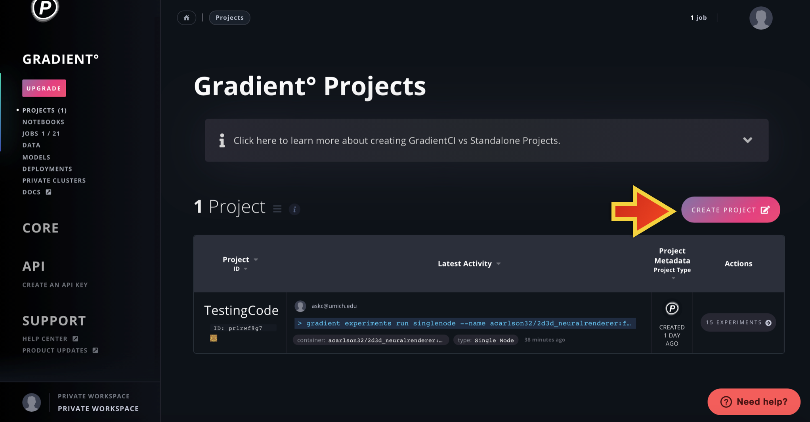
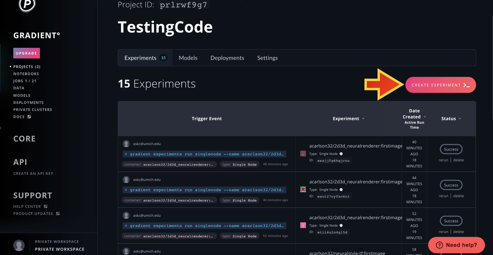
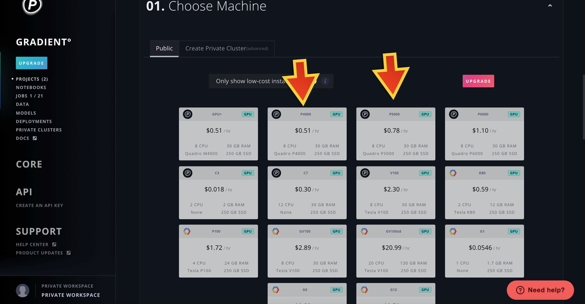
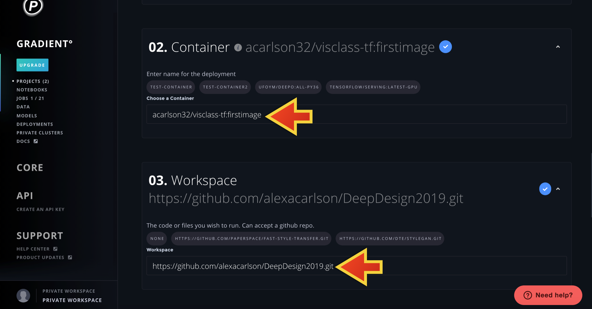
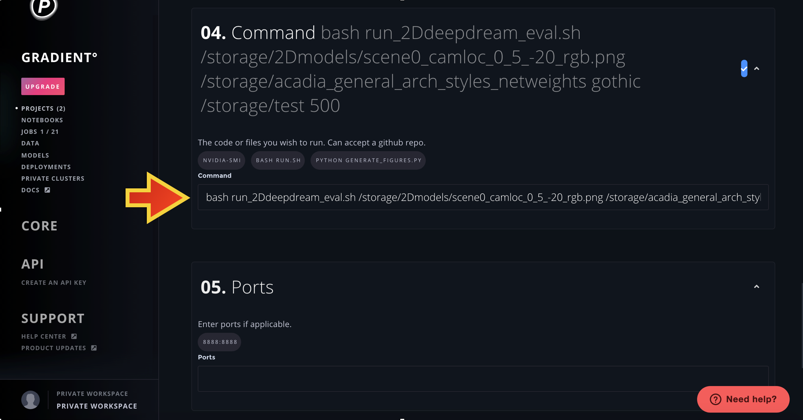
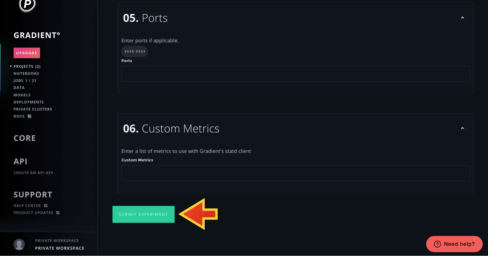

# Executing Models using Paperspace Gradient Experiment Builder
The Paperspace Experiment Builder is a wizard-style UI tool to submit a job. You can use it for both training and testing models.  

This tutorial will proceed as follows: first we will step through how to submit an Experiment using the 2D class-based deep dreaming code as an example, and after that will be a list of commands that will be needed to run the other code provided in the DeepDesign repository, accessed [here](#evaluating-2D-class-based-deep-dream). We also provide an example of how to run code from a separate github repository as well [here](#running-other-github-repositories-using-the-gradient-experiment builder). 

## Running 2D, class-based, Deep Dream using the Gradient Experiment Builder
After signing in, click on Gradient in the navigation bar on the left to choose `Projects`. This takes you to the Projects console.

Click on the `+ Create Project` button and select `Create Standalone Project`. This generates a white popup screen that guides you through the different options for setting up your Project. Enter a name for the project when prompted. 

Once you have created a Project, it will appear at the bottom of the Projects console. All of your Projects (and basic information about how many experiments you have in your project, recent activity, etc) will appear here. 
Select a project to enter its console. In the depicted example, we enter the testcode project console.

Now that you are in in the Project console, select the light blue `+ Create Experiment` button on the right hand side of the Project console.This takes you to a new page, where you will step through various options to set up your Experiment. Note that at the bottom of the page, information about each experiment in this specific Project is listed. You can select any experiment to find out more specific information about the command used to start the experiment, the code used to run it, as well as logs regarding the code output and any error logs if the code fails to run.

The first section to appear allows you to choose the provided paperspace sample examples; scroll past this to section 01 (unless you would like to run through those). 
The first step is to choose a machine type for scheduling the Experiment. For the code in our DeepDesign github repository, you can choose either the `P4000` or `P5000` machine types. However, depening on the size of your inputs and outputs, you may need to select a machine type with more RAM (or random access memory; this is similar to working memory for humans, and defines how much memory the machine has to 'solve the problem' with the information you input to it).

Scroll to section 02, where you will input a docker container image to use. This sets up the computing environment that will be run on the machine you chose in the previous section. The best way to understand a container image is that it is a blueprint that defines all the software dependcies that your code will need to run successfully. Below section 02 ia section 03, where you select the Experiment Workspace. This is the code you wish to run, which is in our DeepDesign github repository! Therefore we can input in the url to our repo. This is what is super powerful about the Gradient Experiment builder; you can run any code in any github repository!

Finally, scroll to section 04. This is where you define the command for the job which is the Python script that executes within the context of the container. When the script exits gracefully, the job is marked as complete. If an error is thrown, the job is marked as failed. You can access this information by selecting the experiment on the Project page once the experiment has been submitted.

Scroll past section 05 and 06. We are now ready to kick off the training job by clicking on the Submit Experiment button at the bottom of the page. Gradient adds the job to the queue and schedules it in one of the chosen machine types. 

## Running the other image/mesh editing code in DeepDesign using the Gradient Experiment Builder
You can use the above steps to run any of the other code in the DeepDesign repository! Below we list the container image, workspace, and command needed to run each option. It is important to note that all of the below commands require an output filename as an input. You can save to either `/storage` or to `/artifacts` (which is the default output location for any job/experiment). 

### Evaluating 2D class-based deep dream
This code allows you to augment an input image with the learned features of a specific class from a trained classification neural network. 
When using a pertained network, you first need to upload the custom_weights folder to `/storage` using the notebook tool in the web GUI.

A few things to keep in mind:

  + NOTE THAT INPUT MUST BE IN RGB FORMAT (i.e., three channels)
  + You also have the option of uploading your dreamed images to the /storage folder, you would just need to specify their location in the appropriate run.sh file

2D deep dream Docker container image:

`acarlson32/visclass-tf:firstimage`

Workspace:

`https://github.com/alexacarlson/DeepDesign2019.git`

Command Format:

`bash run_2Ddeepdream_eval.sh IMAGE_DATA WEIGHTS_DIR DREAM_CLASS RESULTS_DIR NUM_ITERS IMAGE_H IMAGE_W`

Command Example:

`bash run_2Ddeepdream_eval.sh /storage/2Dmodels/scene0_camloc_0_5_-20_rgb.png /storage/acadia_general_arch_styles_netweights gothic /storage/test 500 720 1280`

### Training a classifcation network on your dataset to use for 2D class-based deep dream

2D deep dream Docker container image:

`acarlson32/visclass-tf:firstimage`

Workspace:

`https://github.com/alexacarlson/DeepDesign2019.git`

Command Format:

`bash run_2Ddeepdream_training.sh TRAIN_DIR TRAIN_EPOCHS WEIGHTS_DIR RESULTS_DIR NUM_ITERS`

Command Example:

`bash run_2Ddeepdream_training.sh /storage/2Dmodels/scene0_camloc_0_5_-20_rgb.png /storage/acadia_general_arch_styles_netweights gothic /storage/test 500`

### Running 2D style transfer
First, need to create notebook via web GUI, upload vgg weights, called `imagenet-vgg-verydeep-19.mat`, to `/storage`

2D style transfer Docker container image:

`acarlson32/neuralstyle-tf:firstimage`

Workspace:

`https://github.com/alexacarlson/DeepDesign2019.git`

Command Format:

`bash run_2Dneuralstyletransfer.sh CONTENT_FILE STYLE_FILE OUTPUT_FILE IMAGE_SIZE CONTENT_WEIGHT STYLE_WEIGHT`

Command Example: 

`bash run_2Dneuralstyletransfer.sh /storage/2Dmodels/robotics_building_satellite.png /storage/2Dmodels/new000343.png /artifacts/roboticsbuilding_satellite_style000343_styleweight10.jpg 500 5.0 1.0`

### Running 2D to 3D neural renderer for 3D deep dreaming
This project uses the neural 3D mesh renderer (CVPR 2018) by H. Kato, Y. Ushiku, and T. Harada to achieve dreaming and style transfer in 3D. It builds upon the code in (https://github.com/hiroharu-kato/neural_renderer.git)

Note that before running any jobs in this project, you will need to upload the desired 3D models to the paperspace /storage space. Add each 3D model to /storage/3Dmodels.

Neural Renderer Docker container image:

`acarlson32/2d3d_neuralrenderer:firstimage`

Workspace:

`https://github.com/alexacarlson/DeepDesign2019.git`

Command Format:

`bash run_2Dto3Ddeepdream.sh INPUT_OBJ_PATH OUTPUT_FILENAME OUTPUT_DIR NUM_ITER`

Command Example: 

`bash run_2Dto3Ddeepdream.sh /storage/3Dmodels/bench.obj 3Ddreamed_bench.gif /artifacts/results_3D_dream 300`

### Running 2D to 3D neural renderer for 2D to 3D style transfer
This project uses the neural 3D mesh renderer (CVPR 2018) by H. Kato, Y. Ushiku, and T. Harada to achieve dreaming and style transfer in 3D. It builds upon the code in (https://github.com/hiroharu-kato/neural_renderer.git)

Note that before running any jobs in this project, you will need to upload the desired 3D models to the paperspace /storage space. Add each 3D model to /storage/3Dmodels and any 2D models (i.e., images) to /storage/2Dmodels.

Neural Renderer Docker container image:

`acarlson32/2d3d_neuralrenderer:firstimage`

Workspace:

`https://github.com/alexacarlson/DeepDesign2019.git`

Command Format:

`bash run_2Dto3Dstyletransfer.sh INPUT_OBJ_PATH INPUT_2D_PATH OUTPUT_FILENAME OUTPUT_DIR STYLE_WEIGHT CONTENT_WEIGHT NUM_ITERS`

Command Example: 

`bash run_2Dto3Dstyletransfer.sh /storage/3Dmodels/TreeCartoon1_OBJ.obj /storage/2Dmodels/new000524.png 2Dgeo_3Dtree.gif /artifacts/results_2D_to_3D_styletransfer 1.0 2e9 1000`

### Running 2D to 3D neural renderer for 2D to 3D vertex optimization
This project uses the neural 3D mesh renderer (CVPR 2018) by H. Kato, Y. Ushiku, and T. Harada to achieve dreaming and style transfer in 3D. It builds upon the code in (https://github.com/hiroharu-kato/neural_renderer.git)

Note that before running any jobs in this project, you will need to upload the desired 3D models to the paperspace /storage space. Add each 3D model to /storage/3Dmodels and any 2D models (i.e., images) to /storage/2Dmodels.

Neural Renderer Docker container image:

`acarlson32/2d3d_neuralrenderer:firstimage`

Workspace:

`https://github.com/alexacarlson/DeepDesign2019.git`

Command Format:

`bash run_2Dto3Dvertexoptimization.sh INPUT_OBJ_PATH INPUT_2D_PATH OUTPUT_FILENAME OUTPUT_DIR NUM_ITERS`

Command Example: 

`bash run_2Dto3Dvertexoptimization.sh /storage/3Dmodels/TreeCartoon1_OBJ.obj /storage/2Dmodels/new000524.png 2Dgeo_3Dtree /artifacts/results_vertoptim 250`

## Running other github repositories using the Gradient Experiment Builder
What is awesome about the experiment builder is that you can run pretty much any model from a github repository.
As a demonstration, we will step through how to train and test the super resolution GAN model, `pix2pixHD` in the Paperspace Experiment Builder. 

First, `pix2pixHD` is a generative adversarial neural network that transforms one dataset of high resolution images, which we refer to as data domain A, into the style of a different high resolution dataset, which we refer to as data domain B. We use the term domain to desrcibe a dataset because a limited amount of visual information is captured in each dataset, and can vary greatly between datasets. Thus, in a sense, each dataset is it's own little world, or domain! The easiest way to understand this is by thinking of a dataset of purely daytime images compared to a dataset of purely night time images. While both datasets may capture similar structures (buildings, roads cars, people etc), the overall appearance/style is drastically different. The `pix2pixHD` was originally developed to transform semantically segmented maps into corresponding images, but it can be trained to transfer any one dataset into the style of a different dataset. 

#### Training pix2pixHD
For training pix2pixHD, you will need to upload your input data domain A to `/storage/train_A`, and your output data domain B to `/storage/train_B`.

pix2pixHD Docker container:

`datmo/keras-tensorflow:gpu-py35`

Workspace:

https://github.com/NVIDIA/pix2pixHD.git

Command Format:

`python train.py --name <RUNNAME> --dataroot /storage --label_nc 0 --no_instance`

#### Testing pix2pixHD
For testing pix2pixHD, you will need to upload your input data domain A to `/storage/test_A`.

pix2pixHD Docker container:

`datmo/keras-tensorflow:gpu-py35`

Workspace:

https://github.com/NVIDIA/pix2pixHD.git

Command Format:

`python test.py --name label2city_1024p --netG local --ngf 32 --resize_or_crop none $@`
