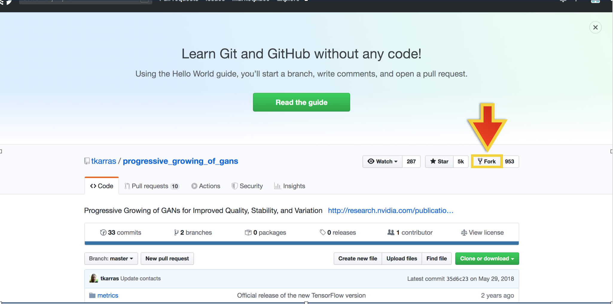

# Executing Models using Paperspace Gradient Experiment Builder
The Paperspace Experiment Builder is a wizard-style UI tool to submit a job. You can use it for both training and testing models.  

This tutorial will proceed as follows: first we will step through how to submit an Experiment using the 2D class-based deep dreaming code as an example, and after that will be a list of commands that will be needed to run the other code provided in the DeepDesign repository, accessed [here](#evaluating-2D-class-based-deep-dream). We also provide an example of how to run code from a separate github repository as well [here](#running-other-github-repositories-using-the-gradient-experiment builder). 

## Running 2D, class-based, Deep Dream using the Gradient Experiment Builder
Before running this experiment, you need to make sure to upload an image and vgg16 neural network weights to your `/storage`. We have provided two sets of examples weights for you to experiment with. 

After signing in, click on Gradient in the navigation bar on the left to choose `Projects`. This takes you to the Projects console.

Click on the `+ Create Project` button and select `Create Standalone Project`. This generates a white popup screen that guides you through the different options for setting up your Project. Enter a name for the project when prompted. 

Once you have created a Project, it will appear at the bottom of the Projects console. All of your Projects (and basic information about how many experiments you have in your project, recent activity, etc) will appear here. 
Select a project to enter its console. In the depicted example, we enter the testcode project console.

Now that you are in in the Project console, select the light blue `+ Create Experiment` button on the right hand side of the Project console.This takes you to a new page, where you will step through various options to set up your Experiment. Note that at the bottom of the page, information about each experiment in this specific Project is listed. You can select any experiment to find out more specific information about the command used to start the experiment, the code used to run it, as well as logs regarding the code output and any error logs if the code fails to run.

The first section to appear allows you to choose the provided paperspace sample examples; scroll past this to section 01 (unless you would like to run through those). 
The first step is to choose a machine type for scheduling the Experiment. For the code in our DeepDesign github repository, you can choose either the `P4000` or `P5000` machine types. However, depening on the size of your inputs and outputs, you may need to select a machine type with more RAM (or random access memory; this is similar to working memory for humans, and defines how much memory the machine has to 'solve the problem' with the information you input to it).

Scroll to section 02, where you will input a docker container image to use. This sets up the computing environment that will be run on the machine you chose in the previous section. The best way to understand a container image is that it is a blueprint that defines all the software dependcies that your code will need to run successfully. Below section 02 ia section 03, where you select the Experiment Workspace. This is the code you wish to run, which is in our DeepDesign github repository! Therefore we can input in the url to our repo. This is what is super powerful about the Gradient Experiment builder; you can run any code in any github repository!

Finally, scroll to section 04. This is where you define the command for the job which is the Python script that executes within the context of the container. When the script exits gracefully, the job is marked as complete. If an error is thrown, the job is marked as failed. You can access this information by selecting the experiment on the Project page once the experiment has been submitted.

Scroll past section 05 and 06. We are now ready to kick off the training job by clicking on the Submit Experiment button at the bottom of the page. Gradient adds the job to the queue and schedules it in one of the chosen machine types. 

## Running the other image/mesh editing code in DeepDesign using the Gradient Experiment Builder
You can use the above steps to run any of the other code in the DeepDesign repository! Below we list the docker container image, workspace, and command needed to run each option. It is important to note that all of the below commands require an output filename as an input. You can save to either `/storage` or to `/artifacts` (which is the default output location for any job/experiment). 
See model tutorials 2-7 in the [Model Zoo](model_zoo.md)

## Running other github repositories using the Gradient Experiment Builder
What is awesome about the experiment builder is that you can run pretty much any model from a github repository! 
As a demonstration, we provide three examples of how to do this: for pix2pixHD, PG-GAN, and cycleGAN.
See model tutorials 1, and 8-10 in the [Model Zoo](model_zoo.md)

## What to do if you need to modify the run code within a github repository
Often you may need to change config files that define the parameters to train a neural network. For example, this is the case for Nvidia's Progressive  Growing of GANs (PG-GAN) model. PG-GAN is a high resolution generative adversarial neural network that takes in a random noise vector and produces an output image that is based upon your training data. It can generate 'unseen'/novel images, because it effectively can interpolate between the training images in the dataset to create new images. 

You will need to fork (which is the same thing as copying the repository to your personal github account) the PG-GAN github repository, located at <https://github.com/tkarras/progressive_growing_of_gans.git>.

A pop-up will appear that will prompt you to copy the PG-GAN repository to your github account.

Once this process is completed, you will have a copy of the PG-GAN repository, and you can experiment with any of the code, e.g., you can alter the `config.py` file to change the training parameters. To run on paperspace, you can use the github link to your copy of the PG-GAN repository as the Workspace. Note that the docker container you can use is `datmo/keras-tensorflow:gpu-py35`.
